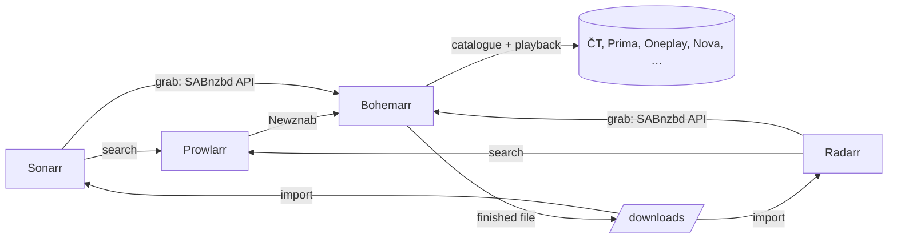

# Bohemarr

**Czech and Slovak TV archives for Sonarr and Radarr.**

Bohemarr puts the video archives of Czech and Slovak broadcasters and streaming services into an *arr stack. Prowlarr, Sonarr and Radarr see it as two things they already understand:

- a **Newznab indexer** that lists episodes and films from the sources you enable;
- a **SABnzbd-compatible download client** that downloads what they grab and hands the finished file back for import.

It downloads the broadcaster's original HTTP, HLS or DASH media. It does not use Usenet or BitTorrent, and it has no web UI: you operate it through your *arr applications, a JSON configuration file and the logs.

Bohemarr started as a TypeScript port of [Media Downloader](https://github.com/sunecz/Media-Downloader) by Sune. See [Credits](#credits).



## Contents

- [Features](#features)
- [Supported sources](#supported-sources)
- [Requirements](#requirements)
- [Quick start](#quick-start)
- [Configuration](#configuration)
- [Connecting Prowlarr, Sonarr and Radarr](#connecting-prowlarr-sonarr-and-radarr)
- [Operating Bohemarr](#operating-bohemarr)
- [Troubleshooting](#troubleshooting)
- [How it works](#how-it-works)
- [Security](#security)
- [Limitations](#limitations)
- [Development](#development)
- [Credits](#credits)
- [License](#license)
- [Legal notice](#legal-notice)

## Features

- **Newznab indexer** with title, season/episode, daily (`season=2026&ep=09/28`) and `tvdbid` searches, categories Movies `2000` and TV `5000`.
- **Series identity matching.** A `tvdbid` search binds the TVDB series to a program only when the source's own metadata agrees on year *and* country, so the Czech *Love Island* is never confused with another country's edition.
- **SABnzbd-compatible download client** with queue, history, pause/resume (global and per job), retry, and removal with optional file deletion.
- **Durable queue in SQLite.** Interrupted downloads return to the queue after a restart and resume from validated checkpoints where the source allows it.
- **HTTP, HLS and DASH downloads**, remuxed with FFmpeg and validated with ffprobe before completion is reported.
- **Widevine-protected sources** are decrypted with Bento4 `mp4decrypt` (see [Limitations](#limitations) for the external key service this needs).
- **Account sessions**: logins are shared between concurrent downloads, renewed before they expire, and replaced exactly once when a service refuses them.
- **Single Docker image** with Node.js 26, a pinned static FFmpeg 9 and Bento4, running as an unprivileged user.

## Supported sources

Each source is a *provider* with an ID used in the configuration file.

| Provider ID | Source | Account | Notes |
| --- | --- | --- | --- |
| `ceskatelevize` | ČT / iVysílání (ČT1, ČT2, ČT24, Sport, Déčko, Art, Edu) | no | Public archive |
| `streamcz` | Stream.cz | no | Public archive |
| `iprima` | Prima+, CNN Prima News, Zoom and other iPrima sites | for Prima+ | `username`, `password`; optional `profile`, `deviceId`. Without an account only the public sites are used. Supports TVDB matching. |
| `oneplay` | Oneplay | yes | `username`, `password`; optional `accountId`, `profile`, `profilePin`. Supports TVDB matching. |
| `novaplus` | TV Nova archive | no | |
| `tncz` | TN.cz | no | |
| `markizaplus` | Markíza archive | no | |
| `markizavoyo` | Voyo SK | yes | `username`, `password`, or a `cookies` value holding a `votoken` session |
| `jojplay` | JOJ Play | yes | `username`, `password` |
| `sledovanitv` | SledovaniTV recordings, events and VOD | yes | `username`, `password`, or a paired device (`deviceId`, `profile`, `cookies`). URLs come from `catalog` entries. |
| `tvprimadoma` | TV Prima Doma | no | |
| `tvautosalon` | TV Autosalon | no | |
| `tvbarrandov` | TV Barrandov archive | optional | `username`, `password` for the premium archive |
| `stvr` | STVR (RTVS) archive | no | URL resolver: search by pasting the URL or use `catalog` entries |
| `html5` | Any page with an HTML5 `<video>` | no | URL resolver |
| `direct` | Direct media file URLs | no | URL resolver |
| `youtube` | YouTube | no | URL resolver; optional `client`, `cookies`, `poToken`, `visitorData`, `playerId` |

Account-based sources need **your own** subscription. Bohemarr does not ship shared accounts and does not bypass paywalls.

## Requirements

- Docker with the Compose plugin (recommended), **or** Node.js 26+, FFmpeg/ffprobe and Bento4 `mp4decrypt` on the host.
- Sonarr and/or Radarr (optionally Prowlarr) that can reach Bohemarr over the network.
- A downloads directory shared between Bohemarr and your *arr applications (or a Remote Path Mapping).

## Quick start

```sh
git clone https://github.com/iamanro/bohemarr.git
cd bohemarr

# Downloads land here. The container runs as uid/gid 1000; give that user write access.
mkdir -p downloads

docker compose up -d --build
docker compose logs bohemarr          # "Bohemarr listening on 0.0.0.0:8787; N providers enabled"
docker compose exec bohemarr cat /data/api-key
```

The API key is generated on first start and stored in `/data/api-key`. You will enter it in Prowlarr, Sonarr and Radarr.

Without a configuration file every public source is enabled and account-based sources stay off. Continue with [Configuration](#configuration) to choose sources and enter accounts, then [connect your *arr applications](#connecting-prowlarr-sonarr-and-radarr).

## Configuration

### The configuration file

Bohemarr reads `/data/config.json` once at startup. The Compose file keeps `/data` in a named volume (`config`), so edit a private copy on the host and copy it in.

1. Create the private copy (it is ignored by Git and excluded from Docker builds):

   ```sh
   mkdir -p data && chmod 700 data
   test -f data/config.json || cp config.example.json data/config.json
   chmod 600 data/config.json
   ```

   If the container already has a configuration, export it first instead:
   `docker compose cp bohemarr:/data/config.json data/config.json`.

2. Edit `data/config.json`. For example, to enable Oneplay:

   ```json
   {
     "providers": {
       "oneplay": { "enabled": true, "username": "you@example.com", "password": "your-oneplay-password" }
     }
   }
   ```

3. Install it into the volume and restart:

   ```sh
   docker compose cp data/config.json bohemarr:/data/config.json
   docker compose exec --user root bohemarr sh -c 'chown 1000:1000 /data/config.json && chmod 600 /data/config.json'
   docker compose restart bohemarr
   ```

Passwords are stored as plain text. Protect the host copy and the Docker volume.

### Top-level settings

| Key | Default | Meaning |
| --- | --- | --- |
| `categories` | `["tv", "movies"]` | Download categories; each becomes `/downloads/<category>/`. Must match the categories set in Sonarr/Radarr. |
| `concurrency` | `2` | Downloads that run at the same time (1–32). |
| `publicUrl` | `http://localhost:<port>` | Origin that Sonarr/Radarr use to reach Bohemarr. It goes into download links and must be reachable from them. |
| `host`, `port` | `127.0.0.1`, `8787` | Listen address. The image sets `HOST=0.0.0.0`. |
| `apiKey` | generated | API key (at least 32 characters). Prefer the `API_KEY` environment variable or the generated file. |
| `downloadsDir` | `./downloads` | Where finished files go. The image uses `/downloads`. |
| `ffmpeg`, `ffprobe`, `mp4decrypt` | from `PATH` | Tool paths; the image already contains all three. |
| `wvApiUrl` | `https://wv.api.md.sune.app/v1/` | Widevine key service used for protected sources. |
| `providers` | `{}` | Per-provider settings (below). |

### Provider settings

Each entry under `providers` is keyed by a provider ID from [Supported sources](#supported-sources):

| Key | Meaning |
| --- | --- |
| `enabled` | `false` turns a provider off. Public providers are on unless disabled. `true` on an account provider without usable credentials **fails startup** with `Provider <id> could not be enabled`, so a typo never goes unnoticed. |
| `username`, `password` | Account login. |
| `profile`, `deviceId`, `accountId`, `profilePin`, `cookies` | Provider-specific options (see the table above). Leave them unset unless you need them. |
| `headers` | Extra HTTP headers for `direct`/`html5` media requests. |
| `catalog` | Static catalogue entries (below). |

A few provider notes:

- **Prima+** registers its web device as part of login. Leave `deviceId` unset unless you need a specific device. Your other devices are never removed.
- **Prima+ catalogue.** Bohemarr builds its own index of Prima+ series and films from iPrima's public sitemaps and stores it in the database. The first Prima+ search waits for the sitemaps (a few seconds). The programme names are then read from the pages in the background, one page per second, because iPrima's CDN blocks an address that sends too many requests. The first pass over the roughly 4,100 programmes takes about an hour and a half. Until then, searches match names derived from the page addresses, and releases still carry the real names. After that, only changed programmes are re-read, and the listing is refreshed when it is older than six hours.
- **SledovaniTV** can reuse an already paired device: `deviceId` is the device ID, `profile` the profile ID and `cookies` the session ID (not a Cookie header). Add `username`/`password` too if Bohemarr should log in again when that session expires.
- **Voyo** accepts a `votoken` session in `cookies`. Once Voyo refuses it, `username`/`password` are required.

### Catalogue entries

URL-only providers (`stvr`, `html5`, `direct`, `youtube`, `sledovanitv`) have no catalogue of their own. To make such media searchable by title, describe it in `catalog`:

```json
{
  "providers": {
    "direct": {
      "enabled": true,
      "catalog": [
        {
          "title": "Episode title",
          "series": "Series title exactly as Sonarr knows it",
          "kind": "tv",
          "season": 1,
          "episode": 2,
          "url": "https://your-media-host.example/episode.mp4"
        }
      ]
    }
  }
}
```

Each entry needs `title`, `kind` (`tv` or `movie`) and an absolute http(s) `url`. Optional fields: `series`, `season`, `episode`, `airDate` (`YYYY-MM-DD`), `year`. The release ID is derived from the provider and URL. A malformed entry fails startup and names the offending entry. Any provider accepts `catalog` entries; they are listed before its own programs.

### Environment variables

Environment variables override the configuration file.

| Variable | Default |
| --- | --- |
| `HOST`, `PORT` | `127.0.0.1`, `8787` (image: `0.0.0.0`) |
| `PUBLIC_URL` | `http://localhost:<port>` (Compose: `http://bohemarr:8787`) |
| `API_KEY` | generated and stored in `<DATA_DIR>/api-key` |
| `DATA_DIR` | `./data` (image: `/data`) |
| `CONFIG_FILE` | `<DATA_DIR>/config.json` |
| `DOWNLOADS_DIR` | `./downloads` (image: `/downloads`) |
| `CONCURRENCY` | `2` |
| `FFMPEG`, `FFPROBE`, `MP4DECRYPT` | tools on `PATH` |
| `WV_API_URL` | see `wvApiUrl` |
| `TZ` | `Europe/Prague` (Compose) |

Compose also reads `DOWNLOADS_PATH` (host directory mounted at `/downloads`, default `./downloads`).

### Networking and paths

- The Compose network is named `bohemarr`. Put Sonarr, Radarr and Prowlarr on it, or give Bohemarr an address they can reach, and set `PUBLIC_URL` to that address. It must **not** be `localhost` from another container's point of view.
- To join an existing *arr network permanently, add it in a local `compose.override.yaml` and keep `PUBLIC_URL`, `DOWNLOADS_PATH` and `API_KEY` in a local `.env` (mode `0600`). Both files are ignored by Git and Compose loads them automatically. A one-off `docker network connect` does not survive re-creating the container.
- The port is published on `127.0.0.1:8787` only. Do not expose Bohemarr to the Internet; use a TLS reverse proxy if it has to cross an untrusted network.
- Mount the **same host directory** at `/downloads` in Bohemarr, Sonarr and Radarr, or add a Remote Path Mapping in the *arr application. Finished files land in `/downloads/<category>/<job-id>/<release name>/`. The folder carries the release name because Sonarr parses it during import. Keep downloads and your library on the same filesystem if you want hardlinks instead of copies.

## Connecting Prowlarr, Sonarr and Radarr

Use either Prowlarr **or** direct indexers in Sonarr/Radarr, not both for the same instance. Otherwise every result appears twice.

### Prowlarr

**Indexers → Add → Generic Newznab**:

| Setting | Value |
| --- | --- |
| URL | `http://bohemarr:8787/newznab` |
| API Path | `/api` |
| API Key | Bohemarr's API key |
| Categories | Movies `2000`, TV `5000` |

Then sync it to your applications under **Settings → Apps**.

### Sonarr / Radarr indexer (without Prowlarr)

**Settings → Indexers → Add → Newznab** with URL `http://bohemarr:8787/newznab`, API path `/api`, the API key, and category `5000` (Sonarr) or `2000` (Radarr). Start with **Interactive Search** only and leave RSS and Automatic Search off until you have seen what the sources return.

### Download client

In each application, **Settings → Download Clients → Add → SABnzbd**:

| Setting | Sonarr | Radarr |
| --- | --- | --- |
| Host | `bohemarr` | `bohemarr` |
| Port | `8787` | `8787` |
| URL Base | empty | empty |
| API Key | Bohemarr's API key | Bohemarr's API key |
| Category | `tv` | `movies` |

Enable **Completed Download Handling**. In the indexer's settings, set this client as the indexer's download client, so Bohemarr results never go to a real Usenet client and your Usenet results never come here. A grab from Bohemarr is a signed *task descriptor* in an NZB envelope that only the instance that issued it accepts, and Bohemarr rejects ordinary NZB files.

The connection test for the indexer lists the newest episode of each program. Slow upstream catalogues can make it take tens of seconds.

## Operating Bohemarr

### Everyday use

Search and grab from Sonarr or Radarr as usual; downloads appear under **Activity**. Good practice for a new series:

1. Add the series **unmonitored** at first, so Sonarr does not start downloading the whole back catalogue.
2. Run an **interactive search** for one episode and check what comes back.
3. Monitor the series when you are happy with the results.

Sonarr searches by TVDB ID. For Oneplay and Prima+ (with an account), the first such search binds the TVDB series to the matching program and stores the binding; later searches reuse it. Other sources are matched by title, season/episode or air date.

### Queue control

Everything is driven through the SABnzbd API, which Sonarr and Radarr call for you:

| Action | Where |
| --- | --- |
| Pause/resume everything | SABnzbd client pause in the *arr UI, or `GET /api?mode=pause` / `mode=resume` |
| Pause/resume one download | `GET /api?mode=queue&name=pause&value=<id>` (or `name=resume`) |
| Retry a failed download | *arr "retry", or `GET /api?mode=retry&value=<id>` |
| Remove (optionally with files) | *arr "remove", or `GET /api?mode=queue&name=delete&value=<id>&del_files=1` |
| Inspect | `GET /api?mode=queue&output=json` and `mode=history` |

Every request needs the API key as the `apikey` query parameter or the `X-Api-Key` header. For example:

```sh
curl -s "http://127.0.0.1:8787/api?mode=queue&output=json&apikey=$API_KEY"
```

A paused job stays paused across restarts. Resuming restarts the job and reuses validated checkpoints; FFmpeg remuxes of clear streams start over.

### Logs and health

```sh
docker compose logs -f bohemarr
curl -s http://127.0.0.1:8787/health     # {"status":"ok"}, no API key needed
```

The image has a Docker health check on `/health`. Useful log lines:

| Log line | Meaning |
| --- | --- |
| `Provider search failed: <id>: …` | One source failed for this search; the others still answered. |
| `<id>: program "…" failed: …` | One program of a source could not be listed and was skipped. |
| `TVDB <n> is unbound for <id>: <reason>` | A TVDB search found no program to bind (see [Troubleshooting](#troubleshooting)). |

### Restart, upgrade and backup

- **Restart:** `docker compose restart bohemarr`. Downloads that were running go back to the queue and continue.
- **Upgrade:**

  ```sh
  git pull
  docker compose up -d --build
  ```

  Stored data is converted automatically on first start. A database from before the project was renamed (`media-downloader.sqlite`) is taken over as `bohemarr.sqlite`.
- **Backup:** everything that matters is in the `/data` volume: `config.json`, `api-key` and `bohemarr.sqlite` (with its `-wal`/`-shm` files). Stop the container before copying the database:

  ```sh
  docker compose stop bohemarr
  docker compose cp bohemarr:/data ./backup-data
  docker compose start bohemarr
  ```

- **Rotate the API key:** delete `/data/api-key` (or change `API_KEY`), restart, and enter the new key in every *arr application. Grabs issued with the old key are no longer accepted.

## Troubleshooting

| Symptom | Cause and fix |
| --- | --- |
| Startup fails with `Provider <id> could not be enabled` | The provider is `enabled: true` but has no usable credentials, or the ID is misspelled. |
| `401` / `Invalid API key` | The *arr application uses a different key than `/data/api-key` or `API_KEY`. |
| Download client test fails, or grabs fail with `Only this instance's task URLs can be submitted` | `PUBLIC_URL` does not match the address the *arr application uses to reach Bohemarr. |
| Import fails: path does not exist | `/downloads` is not the same directory in both containers; fix the mounts or add a Remote Path Mapping. |
| Sonarr finds nothing for a series | Check the log for `is unbound`. `no-candidate`: no program name fits. `identity-incomplete`: TVDB lacks the year or country. `year-mismatch` / `country-mismatch`: the source's metadata disagrees with TVDB. `ambiguous`: more than one program fits. `program-already-bound` / `identity-already-bound`: an earlier binding already claims one side. |
| Results appear but Sonarr rejects them | Sources do not publish resolution or size. Your quality profile or size limits may reject releases parsed as `WEBDL-480p`, or with size 0. |
| `An ongoing … live stream cannot be imported` or `Live … streams are not supported for download` | Live broadcasts are refused on purpose; wait until the programme is in the archive. |
| Playback denied for an account source | The account lacks the entitlement, or its session was refused twice. Check the credentials; Bohemarr logs in again once by itself. |
| iPrima answers `HTTP 403` everywhere (log: `iPrima refused a page`) | iPrima's CDN temporarily blocks addresses that send too many requests, playback included. In tests it lifted after about ten minutes. Do not run other iPrima scrapers from the same address. |
| Protected download fails at the key step | The Widevine key service (`wvApiUrl`) or the source's licence server is unreachable. |

## How it works

| Part | Responsibility |
| --- | --- |
| Newznab indexer (`src/indexer.ts`) | Translates Newznab queries and answers, and signs task descriptors. |
| Series bindings (`src/series-binding.ts`) | Resolves TVDB identities, binds them to programs and stamps results with the canonical series title. |
| Catalogue browsing (`src/catalogue.ts`) | One paging implementation for every provider: matching, dedupe, early stop, ranking, failure policy. |
| Providers (`src/providers/`) | List each source's programs and releases and resolve playback. |
| Account sessions (`src/providers/account-session.ts`) | Shared logins, renewal and a single re-login after a rejected session. |
| Queue (`src/queue.ts`, `src/store.ts`) | Persistent jobs in SQLite, concurrency, pause/resume/retry/remove. |
| SABnzbd API (`src/sabnzbd.ts`) | The download-client interface for Sonarr/Radarr. |
| Media pipeline (`src/media/`) | Direct, HLS and DASH downloads with checkpoints, protected media via a Widevine CDM plus `mp4decrypt`, FFmpeg remux and ffprobe validation. |

Domain vocabulary is defined in [`CONTEXT.md`](CONTEXT.md), architecture decisions in [`docs/adr/`](docs/adr/).

## Security

- Every endpoint except `/health` requires the API key.
- Task descriptors are signed with the API key (HMAC-SHA256), so foreign or modified NZBs are rejected.
- The container runs as an unprivileged user, and external tools are started with argument arrays, never through a shell.
- YouTube player scripts run in a memory- and time-limited QuickJS sandbox without file-system or network access.
- Account passwords sit in plain text in `/data/config.json`; restrict access to that volume.

## Limitations

- **External services.** Protected (Widevine) sources need a key service; by default this is the one operated by the original Media Downloader project (`wv.api.md.sune.app`). TVDB metadata comes from Sonarr's public Skyhook API. If either changes or disappears, the dependent features stop working.
- **Undocumented upstream APIs.** Sources change their sites and APIs without notice; a provider can break until it is updated.
- **No resolution or size metadata** from most sources, so Sonarr often parses releases as `WEBDL-480p` with size 0.
- **Verified sources.** Account-based playback has been verified for Oneplay (including a protected episode) and for Prima+ on clear media. JOJ Play, Voyo SK, SledovaniTV and protected Prima+ content have not been verified with an entitled account.
- No web UI; operation is through the *arr applications and the API.

## Development

Requires Node.js 26+ and FFmpeg/ffprobe. The protected-media tests also need Bento4 `mp4decrypt` and a current FFmpeg (Debian 12's 5.1 cannot read their encrypted fixture); without `mp4decrypt` they are skipped with `mp4decrypt not installed`.

```sh
npm ci
npm run check   # type-check sources and tests (TypeScript 7)
npm test        # node --test; Node runs the TypeScript directly
npm run dev     # node --watch src/main.ts
npm run build && npm start
```

Node executes the TypeScript sources through its built-in type stripping, so the code uses erasable syntax only: no enums, namespaces or constructor parameter properties. Relative imports use `.ts` extensions, and `npm run build` rewrites them to `.js` in `dist/`.

`docker build --target test .` type-checks and runs the whole suite with the same FFmpeg and Bento4 binaries as the production image. `docker build .` builds the production image.

## Credits

Bohemarr started as a headless TypeScript port of **Media Downloader** by **Sune** ([sunecz](https://github.com/sunecz)), MIT licensed:

- [Media Downloader](https://github.com/sunecz/Media-Downloader), the desktop application;
- [Media Downloader Default Plugins](https://github.com/sunecz/Media-Downloader-Default-Plugins), the source plugins;
- [Media Downloader DRM Plugin](https://github.com/sunecz/Media-Downloader-DRM-Plugin), protected media support.

Much of the source-specific knowledge in `src/providers/` and the protected-media flow comes from those projects. Their MIT license and copyright notice are kept in [`LICENSES/Media-Downloader-MIT.txt`](LICENSES/Media-Downloader-MIT.txt). Thank you, Sune.

Bohemarr also stands on [Sonarr](https://sonarr.tv), [Radarr](https://radarr.video) and [Prowlarr](https://prowlarr.com) (whose conventions it follows but is not affiliated with), [FFmpeg](https://ffmpeg.org) (static builds by [BtbN](https://github.com/BtbN/FFmpeg-Builds)), [Bento4](https://www.bento4.com), [Fastify](https://fastify.dev), [cheerio](https://cheerio.js.org), [fast-xml-parser](https://github.com/NaturalIntelligence/fast-xml-parser), [YouTube.js](https://github.com/LuanRT/YouTube.js) and [quickjs-emscripten](https://github.com/justjake/quickjs-emscripten).

## License

Bohemarr is licensed under the **GNU Affero General Public License v3.0 or later** ([`LICENSE`](LICENSE)). If you run a modified version as a network service, you must offer its users the corresponding source code.

Portions derived from Media Downloader remain available under the MIT license ([`LICENSES/Media-Downloader-MIT.txt`](LICENSES/Media-Downloader-MIT.txt)).

The Docker image bundles third-party programs under their own licenses: FFmpeg (GPL; license and source reference in `/usr/share/doc/ffmpeg/`) and Bento4 `mp4decrypt` (GPL; its source archive is at `/usr/share/bento4-source.tar.gz`).

## Legal notice

Use Bohemarr only for content you are entitled to access and download, and respect the terms of the services you use. Bohemarr is not affiliated with or endorsed by any broadcaster or streaming service named here, and all trademarks belong to their owners. Account-based sources require your own valid subscription; Bohemarr does not circumvent paywalls or geographic restrictions. Whether downloading protected content for private use is lawful depends on your jurisdiction; you are responsible for how you use this software.
